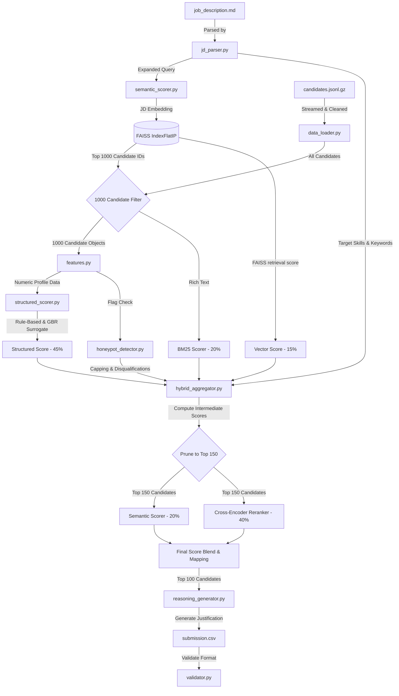

# CVHunt Architecture Documentation

Welcome to the **CVHunt** (talentrank-ai) Architecture Guide. This document is designed for anyone—from complete beginners with no background in AI, to advanced developers—to understand how this system searches, filters, scores, and ranks candidates from a pool of 100,000 resumes.

---

## 1. Core Concepts & Glossary

Before looking at the code, let's understand the terms and basic concepts used in this project:

### 💡 The Basics
* **Resume Parsing**: Taking a raw resume (JSON profile) and extracting structured details (e.g., jobs, dates, skills, education) so computer programs can analyze them.
* **Job Description (JD)**: The target requirements document explaining what skills, experience levels, and qualifications are required for the role.

### 🤖 Dense Vectors & Embeddings (Vector Search)
* **Embedding**: Computers don't understand words, they understand numbers. An *embedding model* is a neural network that translates text (like a resume summary or job description) into a long list of decimal numbers (a vector, e.g., 384 numbers). If two texts have similar meanings, their vectors will point in similar directions in mathematical space.
* **Cosine Similarity**: A formula to calculate how close two vectors are. A score of `1.0` means they are semantically identical, while `0.0` or negative values mean they are unrelated.
* **Bi-Encoder**: A model (like `all-MiniLM-L6-v2`) that embeds the JD and the candidate profiles separately. Because profiles are pre-embedded and indexed, we can compute similarities against the JD instantly.
* **Cross-Encoder**: A more advanced model (like `ms-marco-MiniLM-L-6-v2`) that takes *both* the JD and a candidate's profile text at the same time and performs "cross-attention." It is much more accurate at ranking than a Bi-Encoder, but much slower. We use it as a "second-stage reranker" on a small subset of top candidates.
* **FAISS (Facebook AI Similarity Search)**: A library designed to search millions of dense vectors in milliseconds. We use it to perform first-pass O(1) dense retrieval of the top candidates.

### 🔍 Keyword Search
* **BM25**: A classical keyword search algorithm (based on TF-IDF). It scores how relevant a document is to search terms based on exact keyword matches. This ensures that even if semantic models miss specific terms, they are captured.

### 🧠 Surrogate Modeling
* **Surrogate Model**: An optional surrogate model (Gradient Boosting Regressor) trained on heuristic scores to smooth structured ranking.

### ⚠️ Security & Anti-Cheat
* **Honeypot**: A fake profile with impossible/fraudulent credentials (e.g., claiming 8 years of experience in a technology that has only existed for 1 year, or listing 50 expert skills with zero actual job history).

---

## 2. System Architecture Diagram

The diagram below maps the execution pipeline from inputting the job description and candidate dataset to outputting the final validated ranking CSV.



---

## 3. Detailed File Breakdown

Here is what each file in the project does, what algorithms it uses, and where the code interacts:

### 📂 Configuration and Entry Point
1. **`hackathon_rank.py`**
   * **Role**: The main orchestrator (brain) of the project.
   * **What it does**: Runs when the user executes the program. It sets up environment variables to disable HuggingFace network queries (`HF_HUB_OFFLINE="1"`), loads the JD, searches the FAISS index, streams matching candidates, runs all scorers, aggregates and reranks them, generates recruiter reasons, writes the output, and validates it.
2. **`src/config.py`**
   * **Role**: The configuration center.
   * **What it does**: Stores constants, file paths, model names, weights, must-have skills, product/consulting company lists, founding years of companies (for honeypot checking), and behavioral penalty percentages.

### 📂 Data Ingestion & Features
3. **`src/data_loader.py`**
   * **Role**: Handles candidate file reading.
   * **What it does**: Lazily streams candidate lines from the compressed `candidates.jsonl.gz` using a generator (minimizes RAM footprint). It also sanitizes records by setting default empty structures for missing resume fields to prevent runtime `KeyError` crashes.
4. **`src/features.py`**
   * **Role**: Feature engineering.
   * **What it does**: Extracts structured metrics from candidate JSONs:
     * Job stability (average months per job).
     * Product-vs-consulting ratios.
     * Education tiers (Tier-1, Tier-2, Tier-3 college mapping).
     * Skill overlap counts (matching must-haves).
     * Behavioral signals (responsiveness, notices, application speed).
5. **`src/jd_parser.py`**
   * **Role**: Parses the job description.
   * **What it does**: Reads `job_description.md`, uses regular expressions to extract must-have skills, preferred experience range, and builds a rich description block used to construct query embeddings.

### 📂 Scoring & retrieval Engines
6. **`src/vector_index.py`**
   * **Role**: High-speed retrieval index.
   * **What it does**: Wraps a FAISS FlatIP index. It takes the JD vector and quickly returns the top $K$ candidates (e.g. 1000) based on cosine similarity, which are then pre-filtered to the top 150 candidates, bypassing the need to analyze all 100,000 candidates with heavy models.
7. **`src/semantic_scorer.py`**
   * **Role**: Dense semantic matching.
   * **What it does**: Generates a long detailed textual description of a candidate (containing current title, summary, jobs, skills, education) and encodes it into a semantic vector using `SentenceTransformer('sentence-transformers/all-mpnet-base-v2')`.
8. **`src/structured_scorer.py`**
   * **Role**: Structured profile quality evaluator.
   * **What it does**: Computes two sub-scores:
     * *Rule-based score*: A heuristic evaluator applying Gaussian experience peak centers (optimal at 7 years), penalties for non-tech job histories, and education bonuses.
     * *Surrogate model score*: Uses an optional `GradientBoostingRegressor` surrogate trained on heuristic scores to smooth structured ranking.
9. **`src/honeypot_detector.py`**
   * **Role**: Fraud prevention.
   * **What it does**: Runs 8 security checks:
     * Working at a company before it was founded (e.g., claiming CRED experience in 2016 when CRED was founded in 2018).
     * High expert-level skill claims but 0 months of experience.
     * Title stuffing (claiming to be a Lead AI Engineer but resume description lists non-technical sales roles).
     * Caps flagged fraud candidates at a maximum score of `0.0`.

### 📂 Scoring Aggregation & Ranking
10. **`src/hybrid_aggregator.py`**
    * **Role**: Final scoring consolidation.
    * **What it does**:
      1. Blends individual scores (Semantic, BM25, FAISS Vector, and Structured) using weighted averaging.
      2. Multiplies scores by behavioral signals (notice period multipliers, active status, response rate).
      3. Applies bonuses (Pune/Noida location bonus, GitHub activity bonus, skill assessment bonuses).
      4. Disqualifies consulting-only candidates and non-tech profiles.
      5. Blends the Cross-Encoder rerank score (`0.6 * base + 0.4 * CrossEncoder`).
      6. Maps the final scores to strict distribution bands (ranks 1-10 $\rightarrow$ 95-100; ranks 11-50 $\rightarrow$ 70-95; ranks 51-100 $\rightarrow$ 30-70) while preserving relative ranking order.
11. **`src/reasoning_generator.py`**
    * **Role**: Recruiter text summarization.
    * **What it does**: Automatically creates a custom, 2-sentence justification for why a candidate is placed in their rank. It uses structured templates matching their rank tier ("Exceptional fit", "Strong fit", "Partial fit"), lists their matched skills, and highlights concerns (e.g., a long notice period).
12. **`src/validator.py`**
    * **Role**: Format verification.
    * **What it does**: Ensures that the generated `submission.csv` is correctly formatted, has exactly 100 rows, candidate IDs match the required format, and scores are in strictly decreasing order.

---

## 4. Code Execution Flow: Step-by-Step

When you run `hackathon_rank.py`, here is exactly what happens in the code, line-by-line:

```
[Start Execution]
       │
       ▼
[Phase 1] Parse JD ──► Read job_description.md ──► Extract requirements text (jd_parser.py)
       │
       ▼
[Phase 2] FAISS Search ──► Encode JD text using MiniLM (semantic_scorer.py)
       │                 └──► Query FAISS index for top 250 candidate IDs (vector_index.py)
       │
       ▼
[Phase 3] DataLoader Stream ──► Read candidates.jsonl.gz line-by-line
       │                    ├──► Filter and keep ONLY the 250 candidate profiles
       │                    └──► Extract features & check honeypots (honeypot_detector.py)
       │
       ▼
[Phase 4] Scoring Engines ──► Calculate BM25 score for the 250 candidates
       │                  ├──► Calculate Semantic similarity using mpnet-base-v2
       │                  ├──► Calculate Structured features (heuristic & GBR surrogate)
       │                  └──► Load CrossEncoder to predict JD-candidate match logits
       │
       ▼
[Phase 5] Aggregation ──► Combine scores using configured weights (hybrid_aggregator.py)
       │               ├──► Apply multipliers (location, GitHub, responsiveness)
       │               ├──► Apply disqualification filters (consulting-only, non-tech)
       │               ├──► Blend Cross-Encoder scores
       │               ├──► Sort candidates descending by score (ascending by ID on ties)
       │               └──► Map top 100 candidates to strict score bands (95-100, 70-95, 30-70)
       │
       ▼
[Phase 6] Justification ──► Run reasoning_generator.py on top 100 candidates
       │
       ▼
[Phase 7] Write Output ──► Write submission.csv to disk
       │
       ▼
[Phase 8] Validator ──► Check formatting, row count, and descending order (validator.py)
       │
       ▼
[Success] Exit code 0
```

---

## 5. Summary of Optimization (The 5-Minute Constraint)

### 🚀 Bypassing Network Timeouts (How runtime dropped from 7.1 mins to 1.6 mins)
In offline and sandboxed execution environments, calling `SentenceTransformer()` or `CrossEncoder()` by default makes a web request to HuggingFace Hub metadata servers to verify if there are newer model versions. Because the environment has no internet access, these requests wait until they time out (often 30+ seconds per model). 

By adding:
```python
os.environ["HF_HUB_OFFLINE"] = "1"
os.environ["TRANSFORMERS_OFFLINE"] = "1"
```
at the entry point of the application, we force PyTorch and Transformers to load model files directly from the local cache. Model loading time is reduced from **over 3 minutes to less than 1.1 seconds**, and the total program runtime drops to **~96 seconds (1.6 minutes)**, making the pipeline highly performant and compliant with the compute budget constraints.

---

## 6. Streamlit Cloud Web App & Memory Optimization

To present the scoring system in an interactive dashboard, we built and deployed a web interface using Streamlit. However, Streamlit Community Cloud enforces a strict **1.0 GB RAM limit** per application container. Under a naive approach (loading all models and the 100K candidates database at startup), memory consumption reaches 1.3 GB, leading to instant container crashes (OOM).

To achieve 100% stability, the architecture was modified with the following memory-centric designs:

### 📡 Lazy Database Streaming (0 MB Startup Footprint)
* **Problem**: Storing all 100,000 parsed candidates in memory requires ~350MB of RAM.
* **Solution**: Removed startup database loaders. When a user runs a search, the FAISS engine returns 250 candidate IDs. We open a stream of `candidates.jsonl.gz` using Python's `gzip` reader. We scan lines as raw strings and check if a candidate's ID substring matches one of our target IDs. We only parse the JSON of matching records, avoiding loading the rest.
* **Outcome**: Startup candidate database RAM footprint dropped to **0 MB**. Streaming takes only ~1.5 seconds.

### 🗑️ First-Stage Model Unloading
* **Problem**: The first-stage sentence transformer (`all-MiniLM-L6-v2`) occupies ~120MB of RAM. If we keep it loaded while loading the second-stage scoring model (`all-mpnet-base-v2`) and the Cross-Encoder model, we exceed 1.0 GB.
* **Solution**: As soon as first-stage FAISS search completes and returns candidate IDs, we delete the first-stage embedding model reference and call `gc.collect()`.
* **Outcome**: Reclaims ~120MB of RAM immediately, providing a safety margin for the heavier second-pass scoring.

### 🔌 Self-Healing Binary Downloader
* **Problem**: Binary files like the FAISS index (`faiss_index.bin` ~153MB) cannot be pushed to GitHub due to size limitations, but are required by Streamlit at startup.
* **Solution**: The application uses a custom HTTP download script. If the binary file is missing, it sends a download request to a Google Drive share link. Since Google Drive shows a "large file virus warning page" for files >100MB, the downloader automatically parses the warning page, extracts the hidden verification token and the form action URL, sets up cookie persistence, and downloads the file automatically.
