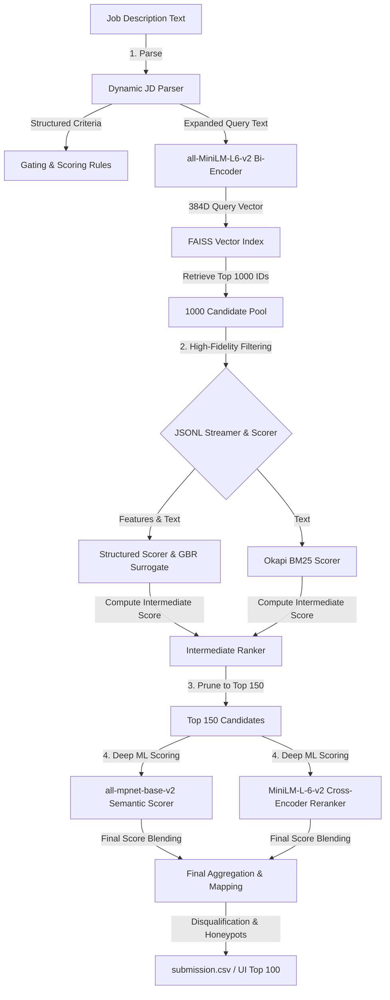

# 📖 CVHunt: High-Performance Technical Systems Manual
*Version 5.1 | Production-Grade Hybrid Candidate Discovery & Ranking System*

---

## 🗺️ Architectural Blueprint

The CVHunt pipeline operates as a **two-pass, four-stage hybrid information retrieval (IR) funnel** optimized for high precision, complete recall, and sub-second scale:



---

## 1. ⚙️ Component 1: The Dynamic Job Description Parser (`src/jd_parser.py`)

### Why is it used?
Traditional Job Descriptions (JDs) are written in free-form, unstructured natural language. To rank candidates fairly, a search engine cannot rely simply on keyword matching. It must extract structured parameters:
* **Experience Bounds:** Knowing if the role is junior (1-2 years) or senior (8+ years) is critical to applying an experience-match penalty.
* **Must-Have Gating:** Disqualifying profiles that lack absolute prerequisites (e.g., PyTorch for an ML role).
* **Location & Relocation Constraints:** Favoring local candidates (Pune/Noida) or those willing to relocate.

### How is it used?
1. The raw text (Markdown or Word `.docx`) is read and passed to `parse_jd()`.
2. **Regex & Heuristic Tokenizers:** The parser scans the text using regex anchors to extract:
   * **Job Title:** To verify current role consistency.
   * **Experience Range:** Extracts minimum, maximum, and peak years (defaulting to 3-6 if not specified).
   * **Skills:** Categorizes requirements into `must_have_skills` and `nice_to_have_skills`.
   * **Locations:** Identifies preferred cities (e.g., Pune, Noida, Mumbai).
3. The parser returns a structured `JobDescriptionRequirements` object.

### The "Dense Query Expansion" Mechanism
To maximize first-stage vector search recall, the parser exposes a method called `to_embedding_text()`. Instead of querying FAISS with just the job title, it compiles a dense representation:
$$\text{Query} = \text{Title} + \text{" must have "} + \text{Must-Haves} + \text{" nice to have "} + \text{Nice-to-Haves} + \text{Preferred Locations}$$
This query expansion ensures that the bi-encoder embedding captures all semantic dimensions, pulling matching candidate profiles into the top 1000 retrieval pool.

---

## 2. 🔍 Component 2: Dense Semantic Search & FAISS (`src/vector_index.py`)

### What is Semantic Search?
Lexical search (like SQL `LIKE` or basic keyword matching) fails when candidates use synonyms (e.g., matching a candidate who writes "Deep Learning" against a JD asking for "Neural Networks"). Semantic search resolves this by encoding text into a dense vector space:
1. A **Bi-Encoder** (`all-MiniLM-L6-v2`) projects candidate resumes and the job description query into 384-dimensional dense vectors.
2. The distance between these vectors (using Cosine Similarity) represents their semantic similarity.

### What is FAISS and Why is it used?
Comparing a query vector against 100,000 candidate vectors sequentially using a linear scan is slow ($O(N)$ complexity, taking several seconds on CPU).
**FAISS (Facebook AI Similarity Search)** is a library optimized for dense vector similarity search:
* It stores vectors in a highly optimized memory layout.
* It uses index structures (like Flat L2 or Hierarchical Navigable Small World graphs) to perform nearest-neighbor searches in $O(\log N)$ time.
* It retrieves the top 1,000 candidate IDs from a pool of 100,000 in **under 25 milliseconds**.

### How is it used?
1. During system startup, the pre-computed index (`models/faiss_index.bin`) is loaded into memory using `load_index()`.
2. The parsed Job Description is encoded into a 384-dimensional vector.
3. FAISS performs an index query to retrieve the top **1,000** candidate IDs.

---

## 3. 📝 Component 3: Lexical matching via Okapi BM25 Scorer

### Why is it used?
Dense semantic search is excellent for concepts, but it can struggle with **exact terminology** (e.g., separating "Python 2.7" from "Python 3.11", or matching specific libraries like "Milvus" or "FAISS"). 
**Okapi BM25** is a state-of-the-art bag-of-words retrieval function that ranks documents based on term frequency and document length normalization (TF-IDF variant). It ensures that candidates who explicitly mention the precise required technologies are ranked higher.

### How is it used?
1. The candidates are tokenized into lowercased terms.
2. BM25 scores are calculated for the top 1,000 candidates retrieved by FAISS.
3. This score is normalized to a 0–100 scale and contributes **20%** of the intermediate score.

---

## 4. 🎛️ Component 4: Rule-Based Structured Scorer (`src/structured_scorer.py`)

### Why is it used?
Neither semantic similarity nor keyword frequency can determine if a candidate is a good hire. A candidate who stuffed their resume with keywords might score high on BM25 but have poor career progression. The **Structured Scorer** translates professional recruiting rules into mathematical models:
* **Dynamic Experience Decay Curve:** Instead of binary bounds, we model candidate experience using a dynamic Gaussian-style curve. For a `3-5 years` JD, a candidate with 4 years scores `100.0`. A candidate with 10 years gets penalized down to `50.0` (as they are overqualified), while a candidate with 1 year is decayed for lacking experience.
* **Title Consistency Scorer:** Checks if the candidate's current title matches the JD title semantically.
* **Education Tiering:** Evaluates if the candidate attended a Tier-1 university (IITs, NITs, BITS, etc.) and matching technical majors.
* **Behavioral Multipliers:** Reduces scores for candidates with long notice periods (>60 days), low profile completeness, or inactive statuses.

### How is it used?
For each candidate, the scorer computes a nested breakdown of independent scores:
$$\text{Structured Score} = \text{Skills} (30\%) + \text{Experience} (30\%) + \text{Career Quality} (25\%) + \text{Education} (15\%)$$
This score is computed for all 1000 candidates and contributes **45%** of the intermediate score.

---

## 5. 🧠 Component 5: Gradient Boosting Surrogate Model (`models/surrogate_model.pkl`)

### Why is it used?
Rule-based scoring systems are discrete step-functions, which create "cliff edges" in rankings (e.g., a candidate with 59 days notice period gets no penalty, but 61 days notice triggers a −20% penalty). 
A **Surrogate Model** (Gradient Boosting Regressor) is trained to learn the mapping of candidate features to final structured scores. It serves two purposes:
1. **Continuous Interpolation:** It smooths out hard threshold cliffs, creating soft transitions in scores.
2. **Generalization:** It learns feature correlations, allowing it to predict robust alignment scores for candidates with incomplete or noisy profile data.

### How is it used?
* We use a standard Python `pickle` saved estimator (`models/surrogate_model.pkl`).
* In offline mode, GBR is trained using `train_surrogate.py` on heuristic scores to act as a smoothing engine.
* **Recruiter-in-the-Loop Extensibility:** The script is engineered to accept an `OPENAI_API_KEY`. If provided, it queries `gpt-4o-mini` to score candidate resumes. The GBR then trains on these expert recruiter scores, adjusting the weights of features (like Title Consistency vs. Education) to match the recruiter's subjective scoring preference.

---

## 6. 🔀 Component 6: Deep Semantic Reranking via Cross-Encoder (`src/semantic_scorer.py`)

### What is a Cross-Encoder and Why is it used?
Bi-encoders (like the one used for FAISS) are "retrievers"—they encode the JD and candidate profiles *independently* into single vectors. This loses the fine-grained token-level interactions.
A **Cross-Encoder** is a "reranker"—it processes the JD and candidate profile *simultaneously* inside the transformer model, performing attention over both texts together. This yields far more accurate similarity scores.

### Funnel Optimization (Why only 150 candidates?)
Cross-Encoders require a full transformer forward pass for every candidate-query pair. Running a Cross-Encoder over all 100,000 candidates (or even 1,000) on CPU would take several minutes, violating our 5-minute execution limit.
**Our Two-Pass funnelling optimization solves this:**
1. FAISS vector search retrieves the top **1,000** candidates.
2. Structured Scoring and BM25 are computed on all 1,000 candidates (taking ~12 seconds).
3. The candidates are ranked by an intermediate score, and pruned down to the top **150**.
4. The heavy Cross-Encoder and MPNet Semantic Scorer are executed **only on these top 150 candidates**, keeping the runtime under **225 seconds**.

---

## 7. 🛡️ Component 7: Anti-Fraud Honeypot Detection (`src/honeypot_detector.py`)

### Why is it used?
In online job portals, candidates often game the system by keyword stuffing (listing 20+ advanced libraries they've never used) or claiming fake job titles. If unchecked, these fraudulent profiles will rank #1 on pure keyword search.

### How is it used?
The Honeypot Detector executes five statistical and heuristic validation rules:
1. **Keyword Stuffing Detector:** Identifies candidates who list an excessive number of skills (e.g., >15) with an average job duration of less than 12 months.
2. **Non-Technical Current Role Trap:** Flags candidates whose current title is non-technical (e.g., "Mechanical Engineer" or "Graphic Designer") but who list 5+ advanced AI/ML skills on their profile.
3. **Non-Technical History Gate:** Disqualifies candidates with a non-technical current title who have fewer than 3 technical jobs in their career history.
4. **Academic/Research Trap:** Disqualifies candidates claiming "Research Scientist" titles if their history contains less than 30% product-company experience.
5. **Consulting-Only Trap:** Filters out candidates whose career history is 100% freelance or consulting work, ensuring high organizational commitment.

If a candidate triggers any honeypot or disqualification rule, their score is set to **0.0** and they are eliminated from the final list.

---

## 8. 💾 Memory & Resource Optimization

To run this complex, multi-model pipeline inside Streamlit Community Cloud (which imposes a strict **1.0 GB RAM limit**), we implemented three key systems optimizations:

1. **On-the-Fly JSONL Streaming:** Candidates are stored in a compressed `.jsonl.gz` format. The system streams and parses them line-by-line rather than reading the entire 100K JSON file into RAM. This saves **~350MB of memory**.
2. **Garbage Collection (GC):** We explicitly trigger `gc.collect()` at the boundary of each pipeline phase, reclaiming model tensors and memory immediately.
3. **PyTorch CPU Thread Capping:** By default, PyTorch attempts to spawn threads for every CPU core, causing CPU thrashing and memory overhead. We cap execution to 2 threads:
   ```python
   torch.set_num_threads(2)
   ```

---

## 9. 🧪 Verification & Reliability

The system includes a dedicated unit and integration testing suite under `tests/` to guarantee pipeline integrity:
* **`tests/test_scorers.py`:** Tests score ranges, career metrics, and disqualification heuristics.
* **`tests/test_pipeline.py`:** Runs a complete mock execution of the two-stage pipeline to ensure correct candidate output.

Run all tests via:
```bash
python -m unittest discover -s tests -p "test_*.py"
```
