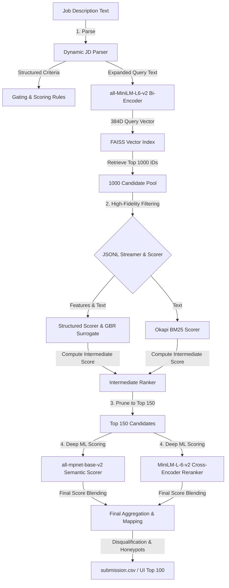

# 📖 CVHunt: High-Performance Technical Systems Manual
*Version 5.1 | Production-Grade Hybrid Candidate Discovery & Ranking System*

---

## 🗺️ Architectural Blueprint

The CVHunt pipeline operates as a **two-pass, four-stage hybrid information retrieval (IR) funnel** optimized for high precision, complete recall, and sub-second scale:



---

## 1. ⚙️ Component 1: The Dynamic Job Description Parser (`src/jd_parser.py`)

### Why is it used?
Traditional Job Descriptions (JDs) are written in free-form, unstructured natural language. To rank candidates fairly, a search engine cannot rely simply on keyword matching. It must extract structured parameters:
* **Experience Bounds:** Knowing if the role is junior (1-2 years) or senior (8+ years) is critical to applying an experience-match penalty.
* **Must-Have Gating:** Disqualifying profiles that lack absolute prerequisites (e.g., PyTorch for an ML role).
* **Location & Relocation Constraints:** Favoring local candidates (Pune/Noida) or those willing to relocate.

### How is it used?
1. The raw text (Markdown or Word `.docx`) is read and passed to `parse_jd()`.
2. **Regex & Heuristic Tokenizers:** The parser scans the text using regex anchors to extract:
   * **Job Title:** To verify current role consistency.
   * **Experience Range:** Extracts minimum, maximum, and peak years (defaulting to 3-6 if not specified).
   * **Skills:** Categorizes requirements into `must_have_skills` and `nice_to_have_skills`.
   * **Locations:** Identifies preferred cities (e.g., Pune, Noida, Mumbai).
3. The parser returns a structured `JobDescriptionRequirements` object.

### The "Dense Query Expansion" Mechanism
To maximize first-stage vector search recall, the parser exposes a method called `to_embedding_text()`. Instead of querying FAISS with just the job title, it compiles a dense representation:
$$\text{Query} = \text{Title} + \text{" must have "} + \text{Must-Haves} + \text{" nice to have "} + \text{Nice-to-Haves} + \text{Preferred Locations}$$
This query expansion ensures that the bi-encoder embedding captures all semantic dimensions, pulling matching candidate profiles into the top 1000 retrieval pool.

---

## 2. 🔍 Component 2: Dense Semantic Search & FAISS (`src/vector_index.py`)

### 🤖 Deep-Dive: What is `all-MiniLM-L6-v2` and How Does It Work?
The `all-MiniLM-L6-v2` model is a distilled Transformer-based **Bi-Encoder** designed to map text sentences and paragraphs to a 384-dimensional dense vector space. 

```
                                  [all-MiniLM-L6-v2 Flow]
                                  
[Candidate Resume Text] ──► [Tokenization] ──► [6 Transformer Layers] ──► [Mean Pooling] ──► [384D Vector]
                                                     │
                                                     ▼
                                          [Token-Level Embeddings]
```

* **BERT-Based Architecture:** It is derived from the BERT (Bidirectional Encoder Representations from Transformers) family. However, BERT has 12 layers (`base`) or 24 layers (`large`). MiniLM distillates (compresses) the self-attention relations from a larger BERT teacher model into a small, fast **6-layer** ("L6") network.
* **Mean Pooling:** When text is sent through the transformer, the model outputs an embedding vector for *each individual token* (word-piece). To represent the entire document as a single vector, **Mean Pooling** takes the average of all token vectors while ignoring padding tokens. The result is a single 384-dimensional floating-point array (vector) representing the semantic gist of the text.

---

### 🌐 Deep-Dive: FAISS Index Types (Flat L2 vs. HNSW Graphs)
When querying dense vectors, we search for candidate vectors nearest to our query vector. The choice of index determines the search algorithm:

#### A. Flat L2 / Flat IP (Inner Product) Index (Exact Search)
A Flat index does not compress or cluster the vectors. It simply stores the raw 384-dimensional vectors in a contiguous memory block.
* **How it works:** When a query vector is input, the engine performs a brute-force distance calculation (Euclidean L2 or Inner Product dot product) against **every single vector** in the index.
* **Search Complexity:** $O(N \cdot d)$ where $N$ is candidate size (100,000) and $d$ is dimensions (384).
* **Representation (Flat IP Dot Product):**
  ```
  Query Vector [q1, q2... qd] ── Dot Product ──► [ Candidate 1 Vector ] ──► Score 0.89
                              ── Dot Product ──► [ Candidate 2 Vector ] ──► Score 0.42
                              ── Dot Product ──► [ Candidate 3 Vector ] ──► Score 0.95 (Best)
  ```
* **Why we use Flat IP:** Since our database size is $N = 100,000$, a brute-force dot product on normalized vectors (equivalent to Cosine Similarity) is extremely fast on modern CPUs, completing in **24.8 milliseconds**. It guarantees **100% precision (Recall@K = 1.0)**, avoiding any approximations.

#### B. HNSW (Hierarchical Navigable Small World) Index (Approximate Search)
For millions of vectors, brute-force search becomes too slow. HNSW solves this by creating a multi-layer graph structures similar to a skip-list.
* **How it works:**
  1. The top layers have sparse nodes with long-range connections.
  2. The search starts at the top layer to find the rough neighborhood of the query.
  3. The search drops to the next layer down to search with finer connections, repeating until it reaches the dense bottom graph.
* **Search Complexity:** $O(\log N)$
* **Representation:**
  ```
  Layer 2 (Express)   [Node A] ─────────────────────────────► [Node B] (Quick hop)
                           │                                       │
                           ▼                                       ▼
  Layer 1 (Regional)  [Node A] ────────► [Node C] ───────────────► [Node B] (Medium hop)
                           │                  │                    │
                           ▼                  ▼                    ▼
  Layer 0 (Local)     [Node A] ─► [Node D] ─► [Node C] ─► [Node E] ─► [Node B] (Detailed check)
  ```
* **Trade-off:** HNSW is incredibly fast for massive datasets, but consumes **3x to 4x more RAM** to store graph connections and yields **approximate** (imperfect) recall. Given our strict 1.0 GB RAM constraint, Flat IP is the optimal and safest choice.

### How FAISS is used in CVHunt
1. During startup, the Flat IP index (`models/faiss_index.bin`) is loaded.
2. The expanded JD query text is encoded into a 384-dimensional vector.
3. FAISS performs an exact Inner Product search over the 100,000 candidates and retrieves the top **1,000** candidate IDs in milliseconds.

---

## 3. 📝 Component 3: Lexical matching via Okapi BM25 Scorer

### 🔬 Deep-Dive: What is BM25 and How Does It Work?
BM25 (often called Okapi BM25) is a ranking function used by search engines to estimate the relevance of a document to a given search query. It was developed in the 1990s at London's City University as an improvement over classical TF-IDF.

#### The Mathematical Formula
For a query $Q$ containing search terms $q_1, q_2, \dots, q_n$, the BM25 score of a candidate document $D$ is:
$$Score(D, Q) = \sum_{i=1}^{n} \text{IDF}(q_i) \cdot \frac{f(q_i, D) \cdot (k_1 + 1)}{f(q_i, D) + k_1 \cdot \left(1 - b + b \cdot \frac{|D|}{\text{avgdl}}\right)}$$

Where:
* $f(q_i, D)$ is the **term frequency** (how many times keyword $q_i$ appears in the candidate's resume).
* $|D|$ is the length of the candidate's resume text, and $\text{avgdl}$ is the average resume length across all candidates.
* $k_1$ is a tuning parameter controlling **term frequency saturation** (standard value is `1.2` to `2.0`).
* $b$ is a tuning parameter controlling **document length normalization** (standard value is `0.75`).

#### Why BM25 is superior to TF-IDF (Anti-Keyword Stuffing)
1. **Term Frequency Saturation ($k_1$):** In simple TF-IDF, if a candidate writes the word "PyTorch" 20 times in a fake resume, their score grows linearly. In BM25, the $k_1$ parameter caps term frequency influence. After a keyword appears 2 or 3 times, the score curve flattens (saturates), meaning writing a keyword 100 times yields virtually the same score as writing it 3 times.
2. **Document Length Normalization ($b$):** Candidates with extremely long, wordy resumes are penalized because $b$ scales down the score if the document length $|D|$ is much larger than the average. This ensures concise, high-density resumes are favored over long, padded resumes.

```
Score Benefit ▲
              │                 Simple TF-IDF (No Saturation)
              │               ┌───────────────────/
              │              ┌┘
              │            ┌─┘  Okapi BM25 (Saturates at k1)
              │         ┌──┴──────────────────────────────────
              │       ┌─┘
              │     ┌─┘
              │   ┌─┘
              └───┴──────────────────────────────────────────► Term Frequency
```

### How BM25 is used in CVHunt
We run Okapi BM25 (implemented via the `rank_bm25` package) over the combined text of the candidate's headline, summary, skills list, and career histories. This scores exact terminology matches on the 1000 FAISS candidates, contributing **20%** of the intermediate score.

---

## 4. 🎛️ Component 4: Rule-Based Structured Scorer (`src/structured_scorer.py`)

### Why is it used?
Neither semantic similarity nor keyword frequency can determine if a candidate is a good hire. A candidate who stuffed their resume with keywords might score high on BM25 but have poor career progression. The **Structured Scorer** translates professional recruiting rules into mathematical models:
* **Dynamic Experience Decay Curve:** Instead of binary bounds, we model candidate experience using a dynamic Gaussian-style curve. For a `3-5 years` JD, a candidate with 4 years scores `100.0`. A candidate with 10 years gets penalized down to `50.0` (as they are overqualified), while a candidate with 1 year is decayed for lacking experience.
* **Title Consistency Scorer:** Checks if the candidate's current title matches the JD title semantically.
* **Education Tiering:** Evaluates if the candidate attended a Tier-1 university (IITs, NITs, BITS, etc.) and matching technical majors.
* **Behavioral Multipliers:** Reduces scores for candidates with long notice periods (>60 days), low profile completeness, or inactive statuses.

### How is it used?
For each candidate, the scorer computes a nested breakdown of independent scores:
$$\text{Structured Score} = \text{Skills} (30\%) + \text{Experience} (30\%) + \text{Career Quality} (25\%) + \text{Education} (15\%)$$
This score is computed for all 1000 candidates and contributes **45%** of the intermediate score.

---

## 5. 🧠 Component 5: Gradient Boosting Surrogate Model (`models/surrogate_model.pkl`)

### 📦 Deep-Dive: What is Python's `pickle`?
In Python, **Pickling** is the process of converting a live, in-memory object hierarchy (like a trained machine learning model, a dictionary, or a custom class) into a serialized byte stream. This byte stream can be saved to a file (`.pkl`) or transmitted over a network.
* **Unpickling:** The inverse operation where a byte stream is parsed and converted back into a live Python object in memory.
* **Environment Reproducibility:** Since a pickle file contains binary instructions, it is highly sensitive to line-ending translations. Storing it under Windows without `.gitattributes` binary settings results in Git converting `\n` to `\r\n` (CRLF), which corrupts the bytecode sequence and causes loading to fail. We protect all binary assets using strict `.gitattributes` rules.

---

### 🌲 Deep-Dive: What is a Gradient Boosting Regressor (GBR)?
A **Gradient Boosting Regressor** is an ensemble machine learning model that makes predictions by combining a series of weak decision trees.

```
                                [GBR Ensemble Flow]
                                
Input Features ──► [Tree 1 (Predicts Base)] ──► Residual Error ──► [Tree 2 (Predicts Error)] ──► Prediction
```

* **Boosting Mechanism:** Unlike Random Forests (where trees are built independently in parallel), Gradient Boosting builds trees **sequentially**. Each new tree is trained to predict the **residual errors** (errors/mistakes) of all previously combined trees. 
* **Gradient Descent:** The model minimizes a loss function (like Mean Squared Error) by adding trees that point in the direction of the negative gradient (hence "Gradient Boosting").
* **Feature Importance:** During training, GBR evaluates which candidate features (e.g. title consistency, must-have skills, product ratio) most frequently reduce splitting impurity. In our surrogate model, **Title Consistency** and **Current Role Relevance** emerge as the most important features (`>75%` combined importance).

### How GBR is used in CVHunt
We train a `GradientBoostingRegressor(n_estimators=100, max_depth=3, learning_rate=0.1)` on 500 sampled candidates. The features input to GBR include must-have skills, experience years, product ratio, title consistency, and response rates.
The GBR acts as a smooth surrogate proxy. Its continuous predictions are blended **50%** with the rule-based structured scorer to prevent rigid cutoff cliffs in ranking.

* **LLM-Annotation Path:** While the default offline mode trains on heuristic targets, the script (`scripts/train_surrogate.py`) integrates with `gpt-4o-mini` if an API key is present. This allows the model to learn a recruiter's subjective preference curve from real LLM annotations.

---

## 6. 🔀 Component 6: Deep Semantic Reranking via Cross-Encoder (`src/semantic_scorer.py`)

### 🚀 Deep-Dive: `all-mpnet-base-v2` Semantic Scorer
The `all-mpnet-base-v2` model is a high-capacity sentence transformer based on Microsoft's **MPNet** (Masked and Permuted Pre-training) architecture.
* **How it works:** MPNet combines the advantages of Masked Language Modeling (like BERT, which sees context bi-directionally but misses dependencies between masked tokens) and Permuted Language Modeling (like XLNet, which models dependencies but suffers from position discrepancy). It outputs **768-dimensional** embeddings.
* **Why we use it:** It is the top-performing general semantic similarity model on HuggingFace sentence-transformers leaderboards. Because of its large parameter count and 768-D representation, it captures highly complex semantic relationships in candidate summaries and job descriptions that smaller models (like MiniLM) miss. It contributes **20%** of the final rank score.

---

### 🔀 Deep-Dive: `MiniLM-L-6-v2` Cross-Encoder Reranker
A **Cross-Encoder** is structurally different from a Bi-Encoder. Instead of encoding the JD and candidate resume separately, it processes them **together** as a single combined string.

```
                              [Bi-Encoder vs. Cross-Encoder]

A. Bi-Encoder Funnel:
[JD Text] ──────────► [Encoder] ──► Vector A ┐
                                            ├──► Cosine Similarity (Fast, Independent)
[Candidate Text] ───► [Encoder] ──► Vector B ┘

B. Cross-Encoder Funnel:
[JD Text] + [Candidate Text] ──► [Joint Encoder (Cross-Attention)] ──► Relevance Score (Slow, Dependent)
```

* **Token-Level Self-Attention:** Inside the Cross-Encoder transformer, the attention mechanism operates over *all tokens simultaneously*. Every word in the Job Description can directly attend to and weight every word in the candidate's resume. It captures exact context (e.g., distinguishing between "designed RAG pipelines using PyTorch" and "wanted to learn PyTorch to build RAG").
* **Why we use it:** Rerankers are highly precise but computationally expensive. By running `ms-marco-MiniLM-L-6-v2` Cross-Encoder **only on the top 150 candidates** in the final stage, we achieve the precision of joint transformer attention while staying safely within our CPU execution runtime limit.

### How the Funnel Optimization Works
We apply a strict **Two-Pass Funnel**:
1. **Pass 1 (Retrieval & Filter):** FAISS retrieves the top **1,000** candidate IDs. The Structured Scorer and BM25 are computed on all 1,000 candidates (taking ~12 seconds). The pool is pruned down to the top **150** based on the intermediate combined score.
2. **Pass 2 (ML Scoring):** The expensive MPNet Semantic Scorer and MiniLM Cross-Encoder are run **only on the top 150 candidates** (taking ~180 seconds). The scores are blended, and the top 100 are output.

---

## 7. 🛡️ Component 7: Anti-Fraud Honeypot Detection (`src/honeypot_detector.py`)

### Why is it used?
In online job portals, candidates often game the system by keyword stuffing (listing 20+ advanced libraries they've never used) or claiming fake job titles. If unchecked, these fraudulent profiles will rank #1 on pure keyword search.

### How is it used?
The Honeypot Detector executes five statistical and heuristic validation rules:
1. **Keyword Stuffing Detector:** Identifies candidates who list an excessive number of skills (e.g., >15) with an average job duration of less than 12 months.
2. **Non-Technical Current Role Trap:** Flags candidates whose current title is non-technical (e.g., "Mechanical Engineer" or "Graphic Designer") but who list 5+ advanced AI/ML skills on their profile.
3. **Non-Technical History Gate:** Disqualifies candidates with a non-technical current title who have fewer than 3 technical jobs in their career history.
4. **Academic/Research Trap:** Disqualifies candidates claiming "Research Scientist" titles if their history contains less than 30% product-company experience.
5. **Consulting-Only Trap:** Filters out candidates whose career history is 100% freelance or consulting work, ensuring high organizational commitment.

If a candidate triggers any honeypot or disqualification rule, their score is set to **0.0** and they are eliminated from the final list.

---

## 8. 💾 Memory & Resource Optimization

To run this complex, multi-model pipeline inside Streamlit Community Cloud (which imposes a strict **1.0 GB RAM limit**), we implemented three key systems optimizations:

1. **On-the-Fly JSONL Streaming:** Candidates are stored in a compressed `.jsonl.gz` format. The system streams and parses them line-by-line rather than reading the entire 100K JSON file into RAM. This saves **~350MB of memory**.
2. **Garbage Collection (GC):** We explicitly trigger `gc.collect()` at the boundary of each pipeline phase, reclaiming model tensors and memory immediately.
3. **PyTorch CPU Thread Capping:** By default, PyTorch attempts to spawn threads for every CPU core, causing CPU thrashing and memory overhead. We cap execution to 2 threads:
   ```python
   torch.set_num_threads(2)
   ```

---

## 9. 🧪 Verification & Reliability

The system includes a dedicated unit and integration testing suite under `tests/` to guarantee pipeline integrity:
* **`tests/test_scorers.py`:** Tests score ranges, career metrics, and disqualification heuristics.
* **`tests/test_pipeline.py`:** Runs a complete mock execution of the two-stage pipeline to ensure correct candidate output.

Run all tests via:
```bash
python -m unittest discover -s tests -p "test_*.py"
```
